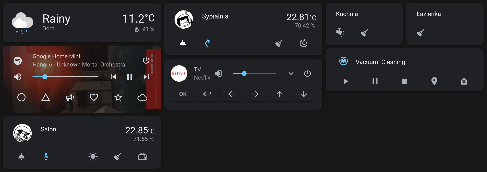

# Home Assistant fun
Place to store configuration and hints on my [Home Assistant](https://www.home-assistant.io/) setup.

## Installation 
### HASS
- [getting started](https://www.home-assistant.io/getting-started/)

### Docker
- [installing Docker](https://docs.docker.com/engine/install/debian/)
- [installing Home Assistant](https://www.home-assistant.io/docs/installation/docker/)
- [using docker-compose](https://www.home-assistant.io/docs/installation/docker/#docker-compose)

## Zigbee devices
- [Mosquitto broker add-on](https://github.com/home-assistant/hassio-addons/tree/master/mosquitto)
- [Zigbee2MQTT add-on](https://github.com/danielwelch/hassio-zigbee2mqtt)
- [configuration with add-ons](https://hejdom.pl/blog/22-home-assistant/96-home-assistant-zigbee2mqtt-cc2531-za-4-i-programowanie-przez-nodemcu.html)
- [supported devices list](https://www.zigbee2mqtt.io/information/supported_devices.html)

## Smart TV
- [Samsung TV Tizen integration](https://github.com/jaruba/ha-samsungtv-tizen)
- [mini-media-player component](https://github.com/kalkih/mini-media-player)

## Spotify
- [Spotify integration](https://www.home-assistant.io/integrations/spotify/)
- [mini-media-player component](https://github.com/kalkih/mini-media-player)
- [playing on Google Home Mini](https://github.com/fondberg/spotcast)

## Vacuum
- [retrieving access token](https://www.home-assistant.io/integrations/xiaomi_miio/#retrieving-the-access-token)
- [cleaning single room](https://hejdom.pl/blog/22-home-assistant/52-home-assistant-xiaomi-roborock-v1-s50-s55-s5-sprzatanie-wybranego-pokoju-glosowo.html)
- [big vacuum card](https://github.com/denysdovhan/vacuum-card)
- [vacuum map card](https://github.com/PiotrMachowski/lovelace-xiaomi-vacuum-map-card)
- [compact vacuum card](https://github.com/benct/lovelace-xiaomi-vacuum-card)

## Cameras
- [RaspberryPi camera](https://www.home-assistant.io/integrations/rpi_camera/)

## Presence detection
- [Device tracking & zones](https://www.home-assistant.io/getting-started/presence-detection/)
- [BLE devices tracking](https://www.home-assistant.io/integrations/bluetooth_le_tracker/) (hint: setting `track_new_devices: True` is required to start without issues)

## Lights & smart plugs
- [Philips Hue integration](https://www.home-assistant.io/integrations/hue/)
- [LSC Smart integration](https://community.home-assistant.io/t/lsc-smart-connect-action/141301)
- [Tuya integration](https://www.home-assistant.io/integrations/tuya/)

## HACS
- [stack-in-card component](https://github.com/custom-cards/stack-in-card)
- [button-card component](https://github.com/custom-cards/button-card)
- [Google Dark Theme](https://github.com/JuanMTech/google_dark_theme)

## HASS add-ons
- [Check Home Assistant configuration](https://github.com/home-assistant/hassio-addons/tree/master/check_config)
- [SSH & Web Terminal](https://github.com/hassio-addons/addon-ssh)